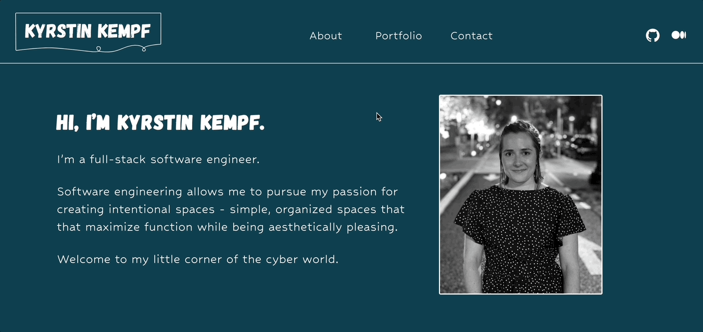

# Kyrstin Kempf - Personal Website

## Description

This website is a single page application using React and json-server. Visitors can learn more about me, view my portfolio, details of each project, and contact me.

## Requirements

To run this application, make sure the following is installed:
- node 16.16
- npm version 9.6.2

## How To Use

1. Fork and clone this repository
3. Run `npm run server`
4. In another terminal, run `npm start` to open the webpage [http://localhost:3000](http://localhost:3000)

To view my website without forking and cloning, visit [https://kyrstinkempf.com](https://kyrstinkempf.com)